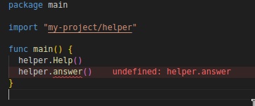

# Your first project

In this chapter, we will cover how to create your first project in Go.

## Introduction

This chapter will cover:

- Creating a project.
- Organize your files.

## Module use cases

There are two interesting use cases with modules:

- **Consuming a module**, you will use a combination of core modules and external 3rd party modules
- **Creating a module**, in some cases you will create code that you or someone else will be able to use. For this scenario, you can create a module and upload it to GitHub.

## Consume internal files

You want to split up your app in many different files. Let's say you have the following files:

```output
/app
  main.go
  /helper
    helper.go
```

What you are saying above is that your program consists of many files and that you want code in the file _main.go_ to use code from _helper.go_ for example.

To handle such a case, you need the following:

- **a project**. By creating a project, you create a top-level reference that you can use in the `import` directive.
- **an import** that points to the project root name as well as the path to the module you want to import.

You can use `go mod init`, this will initialize your project.

## Creating a project

To create a project, you run `go mod init` and a name for a project, for example, "my-project":

```bash
go mod init my-project
```

You end up with a _go.mod_ file looking something like so:

```go
module my-project

go 1.16
```

The _go.mod_ file tells you the name of your project and the currently used version of Go. It can contain other things as well like libraries you are dependent on.

## The import statement

Imagine now we have this file structure in our project:

```output
/app
  main.go
  /helper
    helper.go
```

with _helper.go_ looking like so:

```go
package helper

import "fmt"

func Help() {
  fmt.Println("This is a helper function")
}
```

to use the public `Helper()` function from _main.go_, we need to import it.

In _main.go_ we need an import statement like so:

```go
import (
  "my-project/helper"
)
```

We are now able to invoke the `Help()` function from _main.go_ like so:

```go
helper.Help()
```

## Assignment - create a project

In this assignment, you will create a project.

1. Create a project like so:

   ```go
   go mod init my-project
   ```

1. create the **helper** directory and _helper.go_ file and give it the following content:

   ```go
   // helper.go

   package helper

   import "fmt"

   func Help() {
    fmt.Println("This is a helper function")
   }
   ```

1. Create the _main.go_ file and give it the following content:

   ```go
   package main

   import (
     "my-project/helper"
   )

   func main() {
     helper.Help()
   }
   ```

   Note this import `"my-project/helper"`, it ensures the `helper` package is in scope.

1. Compile and run

   ```bash
   go run main.go
   ```

## Solution

helper/helper.go

```go
package helper

import "fmt"

func Help() {
 fmt.Println("help")
}
```

main.go

```go
package main

import "my-project/helper"

func main() {
 helper.Help()
}
```

## Challenge

See if you can create another function in _helper.go_, this time, make the function name lowercase, what happens if you try to import it?

## Trial (Please try by yourselft)

It showed a message `undefined: helper.answer`. When the program was run, no error was spilled.

helper/helper.go:


main.go:


